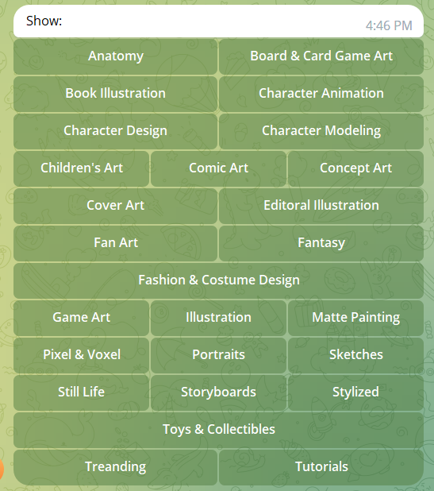

# ArtStation Telegram Bot
This bot have ability to collect artworks by choosen topics.
Send commands belowe to use bot.
```
/start
/menu
```
Also you can send URL like this to extract images.
```
https://www.artstation.com/artwork/RnkAVD 
```

## Bot Config
After you create Telegram Bot, replace **"YOUR_TOKEN"** in  **bot_configs.json** file
```
"BOT_TOKEN": "YOUR_TOKEN"
```
Also **"KEYBOARD_MAP"** contains categories, that can be remove or added. Bot sorts categories A-Z.

If you want to ajust categories, you can modify **bot_configs.json**. After each category, that you want to make new line, add 1 (0 to skip) to **"KEYBOARD_NEW_LINE_PATTERN"**.
### Example
There is **"KEYBOARD_NEW_LINE_PATTERN"** for 26 categories from image:
```
 "KEYBOARD_NEW_LINE_PATTERN": [0, 1, 0, 1, 0, 1, 0, 0, 1, 0, 1, 0, 1, 1, 0, 0, 1, 0, 0, 1, 0, 0, 1, 1, 0, 0],
 ```
 